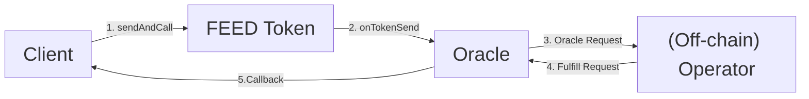

# Oracle: Price Feed Operator

1. The client initiates a transaction by calling the 'sendAndCall' function on the FEED Token smart contract.
2. The 'onTokenSend' event is triggered and broadcasted to the Oracle contract.
3. The Oracle contract processes the event, generating a request that includes both event data and metadata.
4. The off-chain operator monitors for events and responds by fetching and processing the generated requests.
5. Upon successful fulfillment of the request, the Oracle contract emits the relevant data back to the client's contract.